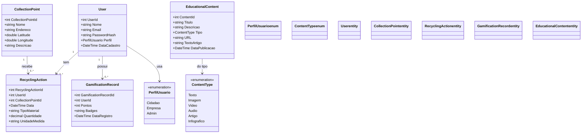

```mermaid
classDiagram
    %% Enums
    class PerfilUsuario {
        <<enumeration>>
        Cidadao
        Empresa
        Admin
    }
    
    class ContentType {
        <<enumeration>>
        Texto
        Imagem
        Video
        Audio
        Artigo
        Infografico
    }
    
    %% Classes principais
    class User {
        +int UserId
        +string Nome
        +string Email
        +string PasswordHash
        +PerfilUsuario Perfil
        +DateTime DataCadastro
    }
    
    class CollectionPoint {
        +int CollectionPointId
        +string Nome
        +string Endereco
        +double Latitude
        +double Longitude
        +string Descricao
    }
    
    class RecyclingAction {
        +int RecyclingActionId
        +int UserId
        +int CollectionPointId
        +DateTime Data
        +string TipoMaterial
        +decimal Quantidade
        +string UnidadeMedida
    }
    
    class GamificationRecord {
        +int GamificationRecordId
        +int UserId
        +int Pontos
        +string Badges
        +DateTime DataRegistro
    }
    
    class EducationalContent {
        +int ContentId
        +string Titulo
        +string Descricao
        +ContentType Tipo
        +string URL
        +string TextoArtigo
        +DateTime DataPublicacao
    }
    
    %% Relacionamentos - sintaxe simplificada compatível
    User "1" --> "0..*" RecyclingAction : tem
    CollectionPoint "1" --> "0..*" RecyclingAction : recebe
    User "1" --> "0..*" GamificationRecord : possui
    User --> PerfilUsuario : usa
    EducationalContent --> ContentType : do tipo
    
    %% Estilos - cada classe em linha separada
    classDef enum fill:#fff2cc,stroke:#d6b656,stroke-width:2px
    classDef entity fill:#dae8fc,stroke:#6c8ebf,stroke-width:2px
    
    class PerfilUsuario enum
    class ContentType enum
    class User entity
    class CollectionPoint entity
    class RecyclingAction entity
    class GamificationRecord entity
    class EducationalContent entity
```