# Diagrama de Classes - Sistema Sustema

```mermaid
classDiagram
    %% Enums
    class PerfilUsuario {
        <<enumeration>>
        +Cidadao : 0
        +Empresa : 1
        +Admin : 2
    }
    
    class ContentType {
        <<enumeration>>
        +Texto : 0
        +Imagem : 1
        +Video : 2
        +Audio : 3
        +Artigo : 4
        +Infografico : 5
    }
    
    %% Classe Principal - User
    class User {
        +int UserId
        +string Nome
        +string Email
        +string PasswordHash
        +PerfilUsuario Perfil
        +DateTime DataCadastro
        +ICollection~RecyclingAction~ RecyclingActions
        +ICollection~GamificationRecord~ GamificationRecords
        --
        +ValidateEmail() bool
        +HashPassword(string password) string
        +CheckPermissions(PerfilUsuario required) bool
    }
    
    %% Pontos de Coleta
    class CollectionPoint {
        +int CollectionPointId
        +string Nome
        +string Endereco
        +double Latitude
        +double Longitude
        +string Descricao
        +string TipoMaterialAceito
        +DateTime DataCriacao
        +ICollection~RecyclingAction~ RecyclingActions
        --
        +CalculateDistance(double lat, double lng) double
        +IsActive() bool
        +GetMaterialTypes() List~string~
    }
    
    %% Ações de Reciclagem
    class RecyclingAction {
        +int RecyclingActionId
        +int UserId
        +int CollectionPointId
        +DateTime Data
        +string TipoMaterial
        +decimal Quantidade
        +string UnidadeMedida
        +User User
        +CollectionPoint CollectionPoint
        --
        +CalculatePoints() int
        +ValidateQuantity() bool
        +GetEnvironmentalImpact() decimal
    }
    
    %% Sistema de Gamificação
    class GamificationRecord {
        +int GamificationRecordId
        +int UserId
        +int Pontos
        +string Badges
        +DateTime DataRegistro
        +DateTime UltimaAtualizacao
        +User User
        --
        +AddPoints(int points) void
        +EarnBadge(string badgeName) void
        +GetCurrentLevel() int
        +GetBadgesList() List~string~
    }
    
    %% Badge System
    class BadgeInfo {
        +string Nome
        +string Descricao
        +string Icone
        +int PontosNecessarios
        +string Categoria
        +bool IsRare
        --
        +CheckEligibility(int userPoints) bool
        +GetBadgeImage() string
    }
    
    %% Conteúdo Educacional
    class EducationalContent {
        +int ContentId
        +string Titulo
        +string Descricao
        +ContentType Tipo
        +string URL
        +string TextoArtigo
        +string ImagemUrl
        +DateTime DataPublicacao
        +string Autor
        +int Visualizacoes
        +bool IsPublished
        --
        +IncrementViews() void
        +ValidateContent() bool
        +GetContentByType(ContentType type) List~EducationalContent~
    }
    
    %% DTOs para transferência de dados
    class UserDto {
        +int Id
        +string Nome
        +string Email
        +PerfilUsuario Perfil
        +DateTime DataCadastro
    }
    
    class RegisterRequest {
        +string Nome
        +string Email
        +string Password
        +PerfilUsuario Perfil
    }
    
    class LoginRequest {
        +string Email
        +string Password
    }
    
    class CollectionPointCreateDto {
        +string Nome
        +string Endereco
        +string Latitude
        +string Longitude
        +string TipoMaterialAceito
    }
    
    %% Relacionamentos principais
    User "1" --> "0..*" RecyclingAction : realiza
    CollectionPoint "1" --> "0..*" RecyclingAction : recebe
    User "1" --> "0..1" GamificationRecord : possui
    User --> PerfilUsuario : tem
    EducationalContent --> ContentType : é do tipo
    
    %% Relacionamentos de herança/composição
    User "1" --> "0..*" UserDto : gera
    User --> RegisterRequest : criado por
    User --> LoginRequest : autentica com
    CollectionPoint --> CollectionPointCreateDto : criado por
    
    %% Relacionamentos de badge
    GamificationRecord "1" --> "0..*" BadgeInfo : contém
    
    %% Estilos
    classDef enum fill:#fff2cc,stroke:#d6b656,stroke-width:2px
    classDef entity fill:#dae8fc,stroke:#6c8ebf,stroke-width:2px
    classDef dto fill:#e1d5e7,stroke:#9673a6,stroke-width:2px
    classDef service fill:#d5e8d4,stroke:#82b366,stroke-width:2px
    
    class PerfilUsuario enum
    class ContentType enum
    class User entity
    class CollectionPoint entity
    class RecyclingAction entity
    class GamificationRecord entity
    class EducationalContent entity
    class BadgeInfo entity
    class UserDto dto
    class RegisterRequest dto
    class LoginRequest dto
    class CollectionPointCreateDto dto
```

## Descrição das Classes

### 🏗️ **Entidades Principais**

#### **User** - Usuário do Sistema
- **Responsabilidade**: Gerenciar informações dos usuários
- **Atributos principais**: Nome, Email, Perfil, Data de cadastro
- **Relacionamentos**: Possui ações de reciclagem e registros de gamificação

#### **CollectionPoint** - Pontos de Coleta
- **Responsabilidade**: Representar locais de coleta seletiva
- **Atributos principais**: Nome, Localização (Lat/Lng), Tipos aceitos
- **Métodos**: Cálculo de distância, validação de status

#### **RecyclingAction** - Ações de Reciclagem
- **Responsabilidade**: Registrar atividades de reciclagem
- **Atributos principais**: Tipo de material, Quantidade, Data
- **Métodos**: Cálculo de pontos, validação, impacto ambiental

#### **GamificationRecord** - Sistema de Gamificação
- **Responsabilidade**: Gerenciar pontos e conquistas
- **Atributos principais**: Pontos totais, Badges, Nível
- **Métodos**: Adicionar pontos, conquistar badges

#### **EducationalContent** - Conteúdo Educativo
- **Responsabilidade**: Gerenciar material educacional
- **Tipos suportados**: Texto, Imagem, Vídeo, Áudio, Artigo, Infográfico
- **Métodos**: Controle de visualizações, validação

### 📋 **DTOs (Data Transfer Objects)**
- **UserDto**: Transferência segura de dados do usuário
- **RegisterRequest**: Dados para registro de novo usuário
- **LoginRequest**: Credenciais de autenticação
- **CollectionPointCreateDto**: Criação de pontos de coleta

### 🔧 **Enumerações**
- **PerfilUsuario**: Cidadão, Empresa, Admin
- **ContentType**: Tipos de conteúdo educacional

### 🎯 **Padrões Implementados**
- **Repository Pattern**: Para acesso a dados
- **DTO Pattern**: Para transferência de dados
- **Service Layer**: Para lógica de negócio
- **Enum Pattern**: Para tipos definidos