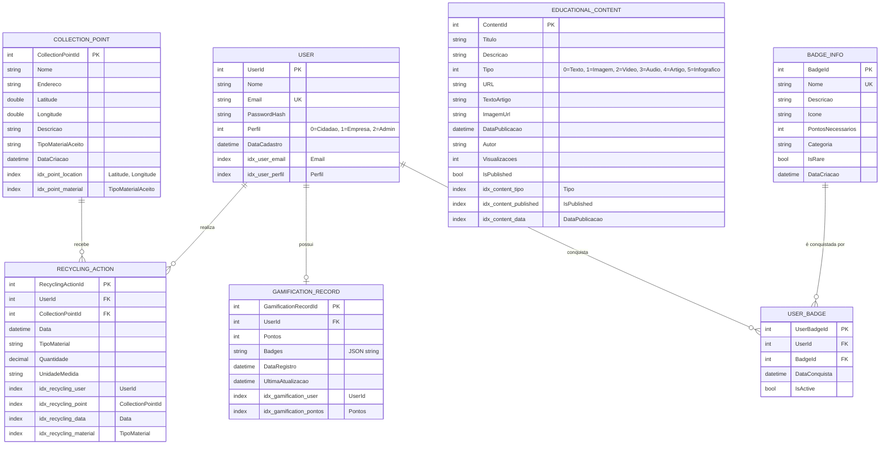

# Diagrama Entidade Relacionamento - Sistema Sustema

## Descrição do Modelo de Dados

### 📊 **Estrutura das Tabelas**

#### **USER** - Tabela Principal de Usuários
- **Chave Primária**: UserId (auto increment)
- **Chave Única**: Email (não permite duplicação)
- **Campos obrigatórios**: Nome, Email, PasswordHash, Perfil
- **Perfil**: Enum (0=Cidadão, 1=Empresa, 2=Admin)

#### **COLLECTION_POINT** - Pontos de Coleta
- **Chave Primária**: CollectionPointId
- **Geolocalização**: Latitude/Longitude para mapeamento
- **Índice espacial**: Para consultas de proximidade

#### **RECYCLING_ACTION** - Ações de Reciclagem
- **Chaves Estrangeiras**: UserId, CollectionPointId
- **Relacionamento**: Muitas ações para um usuário e um ponto
- **Constraints**: Quantidade > 0, Data <= DataAtual

#### **GAMIFICATION_RECORD** - Sistema de Pontuação
- **Relacionamento 1:1**: Um registro por usuário
- **Badges**: Armazenado como JSON string
- **Auditoria**: Campos de criação e atualização

#### **EDUCATIONAL_CONTENT** - Conteúdo Educacional
- **Tipos suportados**: Enum com 6 tipos diferentes
- **Campos condicionais**: URL para vídeos, TextoArtigo para artigos
- **Controle de publicação**: IsPublished para drafts

### 🔗 **Relacionamentos**

#### **1:N (Um para Muitos)**
- User → RecyclingAction (Um usuário, muitas ações)
- CollectionPoint → RecyclingAction (Um ponto, muitas ações)
- User → GamificationRecord (Um usuário, um registro)

#### **N:M (Muitos para Muitos)**
- User ↔ BadgeInfo (via USER_BADGE)
- Usuários podem ter múltiplas badges
- Badges podem ser conquistadas por múltiplos usuários

### 📈 **Índices para Performance**

#### **Consultas Frequentes**
- Busca por email (login)
- Ações por usuário (histórico)
- Pontos por localização (mapa)
- Conteúdo por tipo (filtros)

#### **Otimizações**
- Índice composto para geolocalização
- Índice por data para relatórios temporais
- Índice por tipo de material para estatísticas

### 🛡️ **Constraints e Validações**

#### **Integridade Referencial**
- Cascade delete: User → RecyclingAction
- Restrict delete: CollectionPoint (se tiver ações)
- Soft delete: EducationalContent (IsPublished = false)

#### **Validações de Negócio**
- Email único por usuário
- Quantidade de reciclagem > 0
- Data da ação <= data atual
- Coordenadas válidas (-90 a 90, -180 a 180)