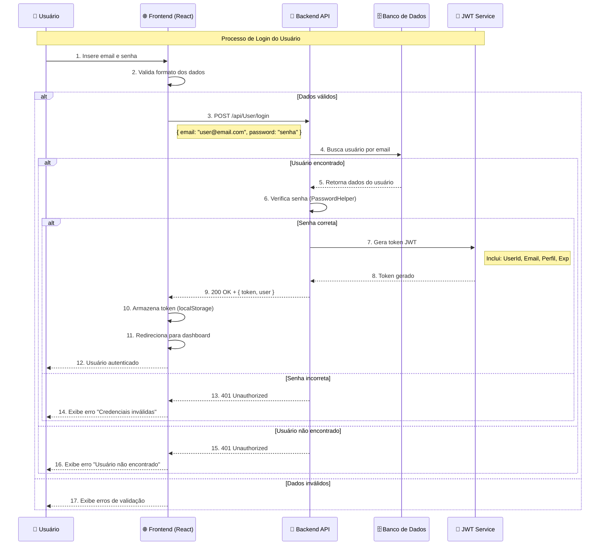
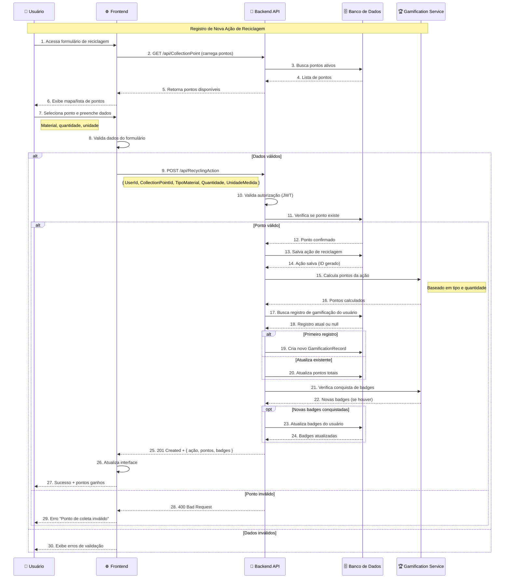
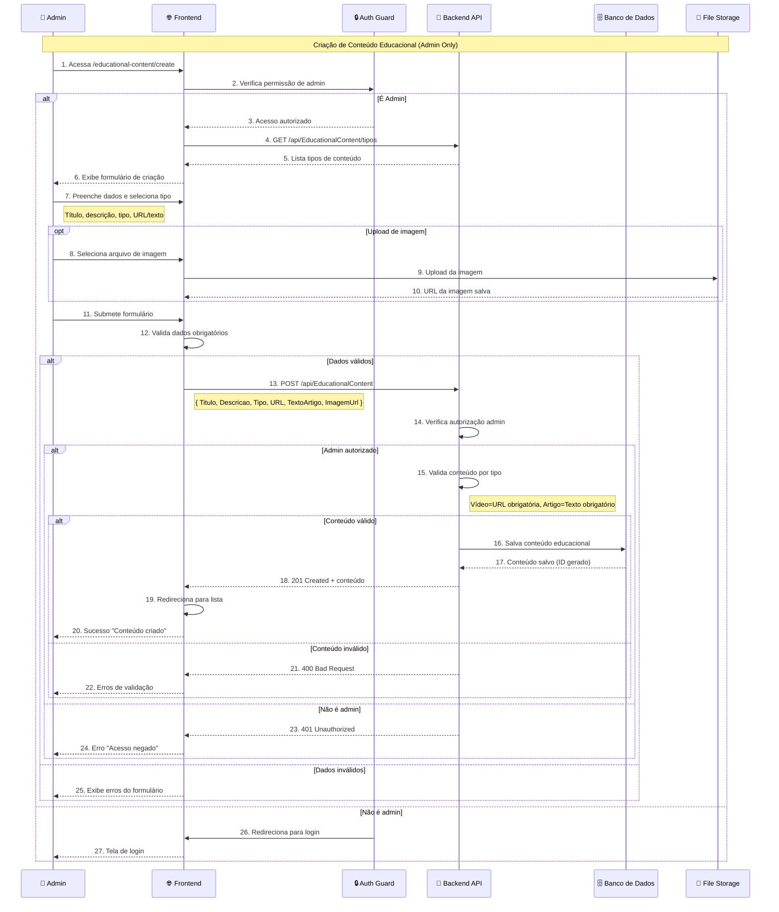
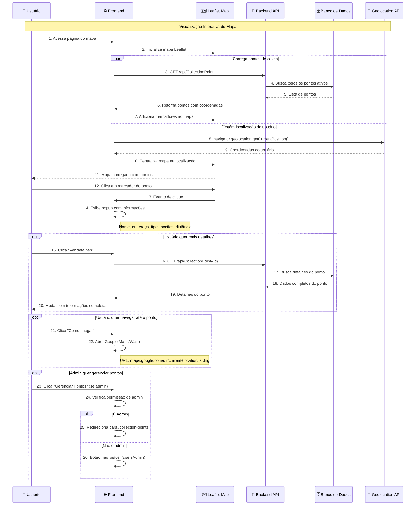

# Diagramas de Sequência - Sistema Sustema

## 1. Fluxo de Autenticação (Login)

## 2. Fluxo de Registro de Ação de Reciclagem

## 3. Fluxo de Criação de Conteúdo Educacional (Admin)

## 4. Fluxo de Visualização do Mapa de Pontos de Coleta

## Descrição dos Fluxos

### 🔐 **Fluxo de Autenticação**
- **Validação em camadas**: Frontend → Backend → Banco
- **Segurança**: Hash de senha, JWT com expiração
- **UX**: Mensagens de erro específicas e redirecionamento

### ♻️ **Registro de Ação de Reciclagem**
- **Gamificação automática**: Cálculo de pontos e badges
- **Validação de negócio**: Verificação de pontos de coleta
- **Feedback imediato**: Pontos ganhos e conquistas

### 📚 **Criação de Conteúdo (Admin)**
- **Controle de acesso**: Verificação de permissão admin
- **Upload de arquivos**: Gestão de imagens
- **Validação por tipo**: Regras específicas por tipo de conteúdo

### 🗺️ **Mapa Interativo**
- **Carregamento paralelo**: Pontos e geolocalização simultâneos
- **Interatividade**: Popups, detalhes, navegação
- **Responsividade**: Adaptação para mobile e desktop