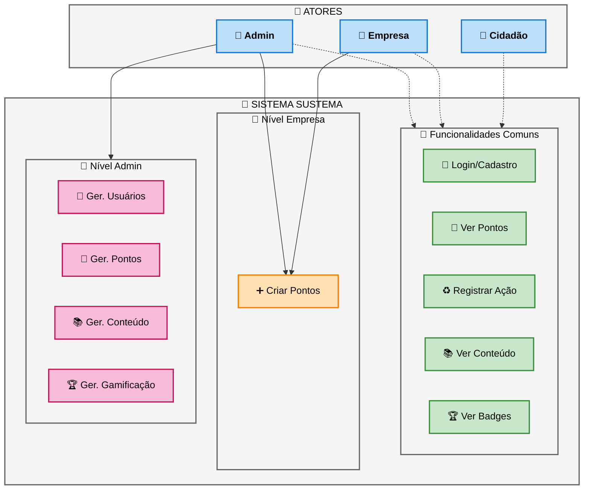

```mermaid
flowchart TB
    %% Layout organizado em camadas
    subgraph Atores["👥 ATORES"]
        direction LR
        Cidadao["👤 Cidadão"]
        Empresa["👔 Empresa"]
        Admin["🔧 Admin"]
    end
    
    subgraph Sistema["🏢 SISTEMA SUSTEMA"]
        direction TB
        
        subgraph Comum["🔹 Funcionalidades Comuns"]
            direction LR
            UC1["🔐 Login/Cadastro"]
            UC2["📍 Ver Pontos"]
            UC3["♻️ Registrar Ação"]
            UC4["📚 Ver Conteúdo"]
            UC5["🏆 Ver Badges"]
        end
        
        subgraph Empresarial["🔸 Nível Empresa"]
            UC6["➕ Criar Pontos"]
        end
        
        subgraph Administrativo["🔹 Nível Admin"]
            direction LR
            UC7["👥 Ger. Usuários"]
            UC8["📍 Ger. Pontos"]
            UC9["📚 Ger. Conteúdo"]
            UC10["🏆 Ger. Gamificação"]
        end
    end
    
    %% Relacionamentos limpos
    Cidadao -.-> Comum
    
    Empresa -.-> Comum
    Empresa --> UC6
    
    Admin -.-> Comum
    Admin --> UC6
    Admin --> Administrativo
    
    %% Estilos melhorados
    classDef ator fill:#bbdefb,stroke:#1976d2,stroke-width:2px,color:#000,font-weight:bold
    classDef comum fill:#c8e6c9,stroke:#388e3c,stroke-width:2px,color:#000
    classDef empresa fill:#ffe0b2,stroke:#f57c00,stroke-width:2px,color:#000
    classDef admin fill:#f8bbd9,stroke:#c2185b,stroke-width:2px,color:#000
    classDef container fill:#f5f5f5,stroke:#666,stroke-width:2px,color:#000
    
    class Cidadao,Empresa,Admin ator
    class UC1,UC2,UC3,UC4,UC5 comum
    class UC6 empresa
    class UC7,UC8,UC9,UC10 admin
    class Atores,Sistema,Comum,Empresarial,Administrativo container
```