# Diagrama de Casos de Uso - Sistema Sustema

```mermaid
flowchart TB
    %% Atores
    subgraph Atores["👥 ATORES"]
        direction LR
        Cidadao["👤 Cidadão"]
        Empresa["👔 Empresa"]
        Admin["🔧 Admin"]
    end
    
    %% Sistema Principal
    subgraph Sistema["🏢 SISTEMA SUSTEMA"]
        direction TB
        
        %% Funcionalidades Públicas
        subgraph Publico["🌐 Funcionalidades Públicas"]
            direction LR
            UC1["🔐 Fazer Cadastro"]
            UC2["🔑 Fazer Login"]
            UC3["📍 Visualizar Pontos de Coleta"]
            UC4["📚 Visualizar Conteúdo Educacional"]
        end
        
        %% Funcionalidades do Cidadão
        subgraph Cidadao_Func["👤 Funcionalidades do Cidadão"]
            direction LR
            UC5["♻️ Registrar Ação de Reciclagem"]
            UC6["🏆 Visualizar Gamificação/Badges"]
            UC7["📊 Acompanhar Pontuação"]
        end
        
        %% Funcionalidades da Empresa
        subgraph Empresa_Func["👔 Funcionalidades da Empresa"]
            UC8["➕ Criar Pontos de Coleta"]
            UC9["📍 Gerenciar Próprios Pontos"]
        end
        
        %% Funcionalidades do Admin
        subgraph Admin_Func["🔧 Funcionalidades do Admin"]
            direction TB
            subgraph Admin_Users["Gestão de Usuários"]
                UC10["👥 Listar Usuários"]
                UC11["➕ Criar Usuários"]
                UC12["✏️ Editar Usuários"]
                UC13["🗑️ Excluir Usuários"]
            end
            
            subgraph Admin_Content["Gestão de Conteúdo"]
                UC14["📚 Gerenciar Conteúdo Educacional"]
                UC15["➕ Criar Conteúdo"]
                UC16["✏️ Editar Conteúdo"]
                UC17["🗑️ Excluir Conteúdo"]
            end
            
            subgraph Admin_Points["Gestão de Pontos"]
                UC18["📍 Gerenciar Todos os Pontos"]
                UC19["✏️ Editar Qualquer Ponto"]
                UC20["🗑️ Excluir Qualquer Ponto"]
            end
            
            subgraph Admin_Game["Gestão de Gamificação"]
                UC21["🏆 Gerenciar Sistema de Pontos"]
                UC22["🎖️ Gerenciar Badges"]
                UC23["📊 Visualizar Relatórios"]
            end
        end
    end
    
    %% Relacionamentos - Funcionalidades Públicas
    Cidadao -.-> Publico
    Empresa -.-> Publico
    Admin -.-> Publico
    
    %% Relacionamentos - Cidadão
    Cidadao --> Cidadao_Func
    
    %% Relacionamentos - Empresa
    Empresa --> Cidadao_Func
    Empresa --> Empresa_Func
    
    %% Relacionamentos - Admin
    Admin --> Cidadao_Func
    Admin --> Empresa_Func
    Admin --> Admin_Func
    
    %% Estilos
    classDef ator fill:#e3f2fd,stroke:#1976d2,stroke-width:3px,color:#000,font-weight:bold
    classDef publico fill:#e8f5e8,stroke:#2e7d32,stroke-width:2px,color:#000
    classDef cidadao fill:#fff3e0,stroke:#f57c00,stroke-width:2px,color:#000
    classDef empresa fill:#fce4ec,stroke:#c2185b,stroke-width:2px,color:#000
    classDef admin fill:#f3e5f5,stroke:#7b1fa2,stroke-width:2px,color:#000
    classDef container fill:#f5f5f5,stroke:#666,stroke-width:2px,color:#000
    
    class Cidadao,Empresa,Admin ator
    class UC1,UC2,UC3,UC4 publico
    class UC5,UC6,UC7 cidadao
    class UC8,UC9 empresa
    class UC10,UC11,UC12,UC13,UC14,UC15,UC16,UC17,UC18,UC19,UC20,UC21,UC22,UC23 admin
    class Atores,Sistema,Publico,Cidadao_Func,Empresa_Func,Admin_Func container
```

## Descrição dos Casos de Uso

### 👥 **Atores do Sistema**

#### 👤 **Cidadão** (Usuário Comum)
- Perfil básico do sistema
- Pode visualizar informações públicas
- Registra ações de reciclagem
- Acompanha gamificação pessoal

#### 👔 **Empresa** 
- Herda funcionalidades do Cidadão
- Pode criar e gerenciar pontos de coleta
- Foca em sustentabilidade corporativa

#### 🔧 **Admin** (Administrador)
- Acesso completo ao sistema
- Gerencia todos os aspectos da plataforma
- Controla usuários, conteúdo e configurações

### 🌐 **Funcionalidades por Nível de Acesso**

#### **Públicas** (Sem autenticação)
- Cadastro e login
- Visualização de pontos de coleta
- Acesso a conteúdo educacional

#### **Autenticadas** (Usuários logados)
- Registro de ações de reciclagem
- Sistema de gamificação
- Gestão de perfil

#### **Administrativas** (Apenas Admin)
- CRUD completo de usuários
- Gestão de conteúdo educacional
- Controle total de pontos de coleta
- Configuração do sistema de gamificação