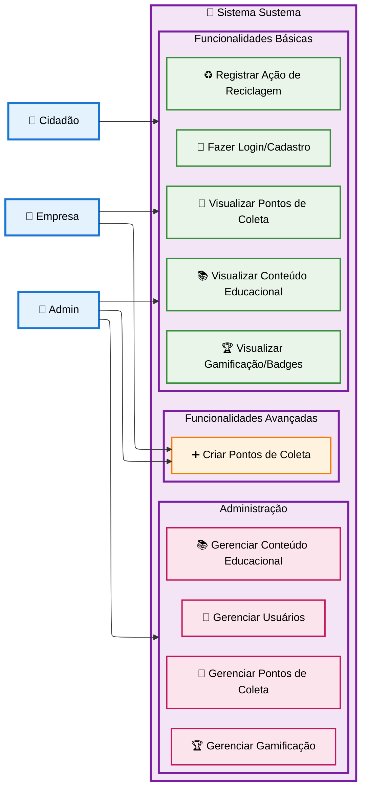

```mermaid
---
config:
  theme: default
  layout: elk
---
flowchart LR
    %% Atores à esquerda
    Cidadao["👤 Cidadão"]
    
    %% Sistema no centro
    subgraph Sistema["🏢 Sistema Sustema"]
        direction TB
        subgraph Basico["Funcionalidades Básicas"]
            UC1["🔐 Fazer Login/Cadastro"]
            UC2["📍 Visualizar Pontos de Coleta"]
            UC3["♻️ Registrar Ação de Reciclagem"]
            UC4["📚 Visualizar Conteúdo Educacional"]
            UC5["🏆 Visualizar Gamificação/Badges"]
        end
        
        subgraph Avancado["Funcionalidades Avançadas"]
            UC6["➕ Criar Pontos de Coleta"]
        end
        
        subgraph Admin["Administração"]
            UC7["👥 Gerenciar Usuários"]
            UC8["📍 Gerenciar Pontos de Coleta"]
            UC9["📚 Gerenciar Conteúdo Educacional"]
            UC10["🏆 Gerenciar Gamificação"]
        end
    end
    
    %% Atores à direita
    Empresa["👔 Empresa"]
    Admin_Actor["🔧 Admin"]
    
    %% Relacionamentos organizados
    Cidadao --> Basico
    
    Empresa --> Basico
    Empresa --> UC6
    
    Admin_Actor --> Basico
    Admin_Actor --> UC6
    Admin_Actor --> Admin
    
    %% Estilos
    classDef actor fill:#e3f2fd,stroke:#1976d2,stroke-width:3px,color:#000
    classDef basicUC fill:#e8f5e8,stroke:#388e3c,stroke-width:2px,color:#000
    classDef advancedUC fill:#fff3e0,stroke:#f57c00,stroke-width:2px,color:#000
    classDef adminUC fill:#fce4ec,stroke:#c2185b,stroke-width:2px,color:#000
    classDef system fill:#f3e5f5,stroke:#7b1fa2,stroke-width:3px,color:#000
    
    class Cidadao,Empresa,Admin_Actor actor
    class UC1,UC2,UC3,UC4,UC5 basicUC
    class UC6 advancedUC
    class UC7,UC8,UC9,UC10 adminUC
    class Sistema,Basico,Avancado,Admin system
```